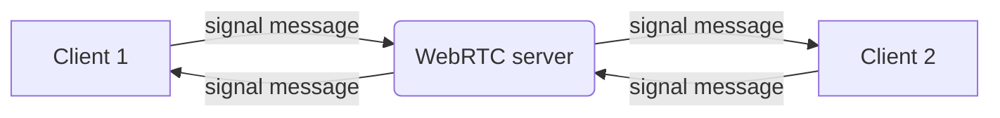

# Document WerRTC server!
	WebRTC server is server realtime message client to client 
	

# Installation

- Nodejs (v6.13.0)
- Clone project from [https://github.com/stove654/fc-webrtc-server](https://github.com/stove654/fc-webrtc-server)
- Open terminal: `npm install`
- Run server env develop: `node index.js`
- Run server env production on Ubuntu: 
  - Install global module `pm2` [https://github.com/Unitech/pm2](https://github.com/Unitech/pm2) 
  - Type: `pm2 start index.js`
- Run server  env production on Window doc [https://github.com/tallesl/qckwinsvc](https://github.com/tallesl/qckwinsvc)
  
## Files Structure
- `package.json` manager module use
-  `index.js` main file js
- `config/config.js` file constant config url, key service we used
- `config/express.js` config with express framework
- `config/socketio.js` config socket io (connect, disconnect, ...)

## Modules Using
- `express` doc [https://expressjs.com/](https://expressjs.com/)
- `http` doc [https://nodejs.org/api/http.html](https://nodejs.org/api/http.html)
- `morgan` for log request in console [https://github.com/expressjs/morgan](https://github.com/expressjs/morgan)
- `body-parser` doc [https://github.com/expressjs/body-parser](https://github.com/expressjs/body-parser)
- `cors` doc [https://github.com/expressjs/cors](https://github.com/expressjs/cors)
- `lodash` doc [https://lodash.com/](https://lodash.com/)
- `socket.io` doc [https://socket.io/](https://socket.io/)
- `twilio` doc [https://www.twilio.com/docs/libraries/node](https://www.twilio.com/docs/libraries/node)

